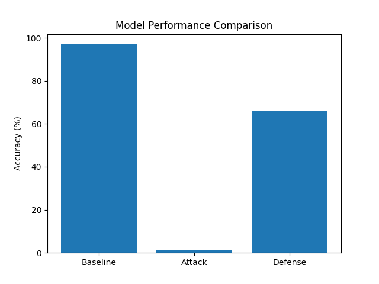

# MNIST Adversarial Attack and Defense Project

## 📌 Overview
This project demonstrates how adversarial attacks affect a neural network trained on the MNIST dataset and evaluates a defense mechanism to improve robustness. The model is first trained under normal conditions, then attacked using the Fast Gradient Sign Method (FGSM), and finally improved using adversarial training.

---

## 🧠 Model Description
- Dataset: MNIST (handwritten digits 0–9)
- Model: Feedforward neural network
- Framework: PyTorch

---

## ⚔️ Adversarial Attack (FGSM)
The Fast Gradient Sign Method (FGSM) is used to generate adversarial examples by adding small perturbations to input images. These perturbations are designed to increase the model’s prediction error.

---

## 🛡️ Defense Method
Adversarial training is implemented by retraining the model using adversarial examples. This helps the model learn to handle both normal and manipulated inputs, improving its robustness.

---

## 📊 Results

| Scenario              | Accuracy |
|----------------------|----------|
| Baseline             | ~97%     |
| Under FGSM Attack    | ~1%      |
| After Defense        | ~66%     |

### 📈 Performance Graph

---

## ▶️ How to Run

1. Install dependencies:
   pip install torch torchvision matplotlib

2. Run the project:

---

## 📁 Project Structure
mnist-adversarial-project/
│── main.py
│── results.png
│── README.md

---

## 📚 References
- Goodfellow, I. J., Shlens, J., & Szegedy, C. (2015). Explaining and harnessing adversarial examples.
- LeCun, Y., Cortes, C., & Burges, C. (2010). MNIST handwritten digit database.
- Madry, A., Makelov, A., Schmidt, L., Tsipras, D., & Vladu, A. (2018). Towards deep learning models resistant to adversarial attacks.

---

## 🎯 Summary
This project highlights the importance of evaluating both performance and security in machine learning systems. While models may achieve high accuracy, they can still be vulnerable to adversarial attacks, making defense strategies essential for real-world applications.
